# TechHer: Let your Data tell you the Real Story: Advanced Analytics on Azure

During this hands on lab at [TechHer UK June 2017](http://techher.uk/) we will be using the services listed below, *click the link to jump to the right section*:
* **Azure Data Lake Analytics** [Link](https://github.com/amynic/TechHer#azure-data-lake-analytics)
* **Azure Machine Learning** [Link](https://github.com/amynic/TechHer#azure-machine-learning)
* **Microsoft Cognitive Services** [Link](https://github.com/amynic/TechHer#microsoft-cognitive-services)
* **Microsoft R Server** [Link](https://github.com/amynic/TechHer#microsoft-r-server-and-r-in-sql-server)
* **Tidy Up Resources** [Link](https://github.com/amynic/TechHer#tidy-up-resources)
* **EXTRA: Azure Machine Learning Workbench Documentation Tutorial** [Link](https://docs.microsoft.com/azure/machine-learning/preview/overview-what-is-azure-ml?WT.mc_id=aiml-0000-amynic) 

For any feedback on the lab please contact me on **Twitter: @amykatenicho** or **LinkedIn: https://www.linkedin.com/in/amykatenicho/** 

### Pre-requistes:
* [An Azure Subscription](https://azure.microsoft.com/free/?WT.mc_id=aiml-0000-amynic)
* A modern web browser

Please download the Azure Storage Explorer and ADLCopy tools from the links above

# Azure Data Lake Analytics

### Exercise 1: Sample Scripts

Lets get started by creating an Azure Data Lake Analytics account

1. **Create an account**
    1. Sign in to the Azure portal.
    2. Click **New > Data + analytics > Data Lake Analytics**.
    3. Select values for the following items: 
        1. **Name:** The name of the Data Lake Analytics account. *[techherinitials]* (note keep this all lowercase and try and have a unqiue name - e.g. include your initials or alias)
        2. **Subscription:** The Azure subscription used for the account.
        3. **Resource Group:** The Azure resource group in which to create the account. *[Techher_initials]*
        4. **Location:** The Azure datacenter for the Data Lake Analytics account. *[North Europe]* 
        5. **Data Lake Store:** The default store to be used for the Data Lake Analytics account. The Data Lake Store account and the Data Lake Analytics account must be in the same location. *[Create new data lake store]*
        6. **Pricing Tier:** Set as Pay-as-you-go
    4. Select Pin to Dashboard
    5. Click Create. 


Once created you will see the screen below load. Have a look around and then click on **'Sample Scripts'** to walk you through some query and process examples for Azure Data Lake Analytics in the Azure Portal.

  

Once loaded click 'Sample Data Missing' and 'U-SQL Advanced Analytics Extensions' to download the data and extensions needed to run the sample.

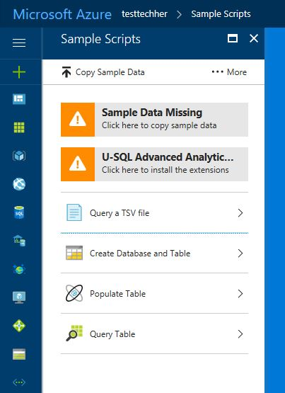

This download will take a couple of minutes


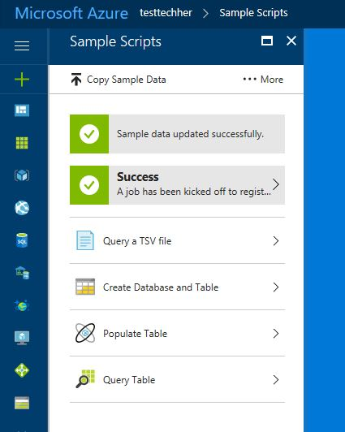

Once completed and you see the green icons above, now choose **'Query a TSV file'** and read through the U-SQL job.

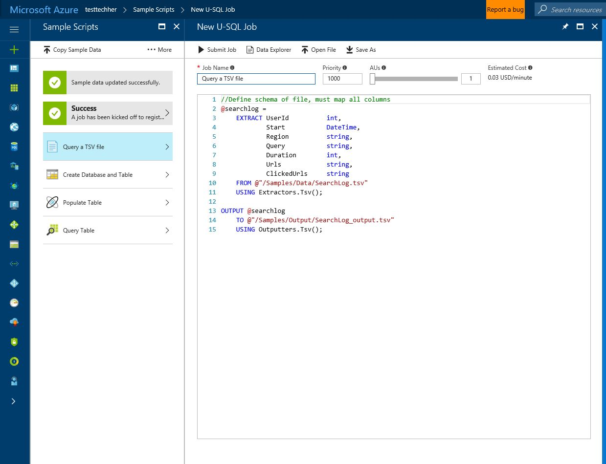

Lets take a look at the datasets being used that are stored in your Azure Data Lake Store account. To do this select 'Data Explorer' at the top of the screen.

Your Azure Data Lake Store will load. Given the input schema given in the query - find the file and view the data

``` FROM @"/Samples/Data/SearchLog.tsv" ```

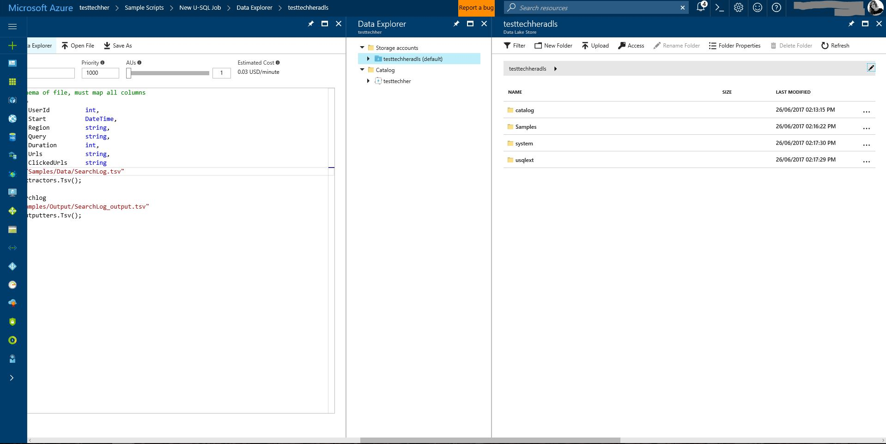

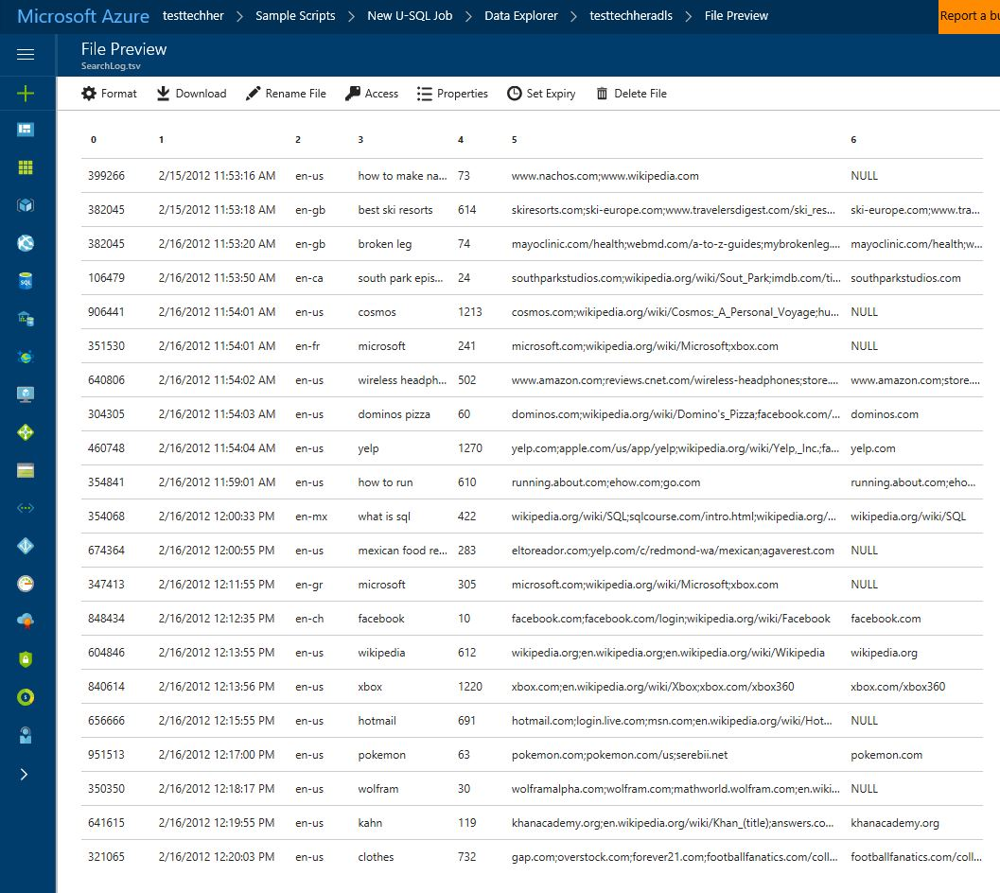

Once you have viewed the data, close the storage windows by clicking the 'X' in the top right of each blade until you only have the 'New U-SQL Job' blade

Now choose submit job using 'Submit Job' button at the top of the blade.

Once submitted you will see a blade with the job details and the progress of the job.

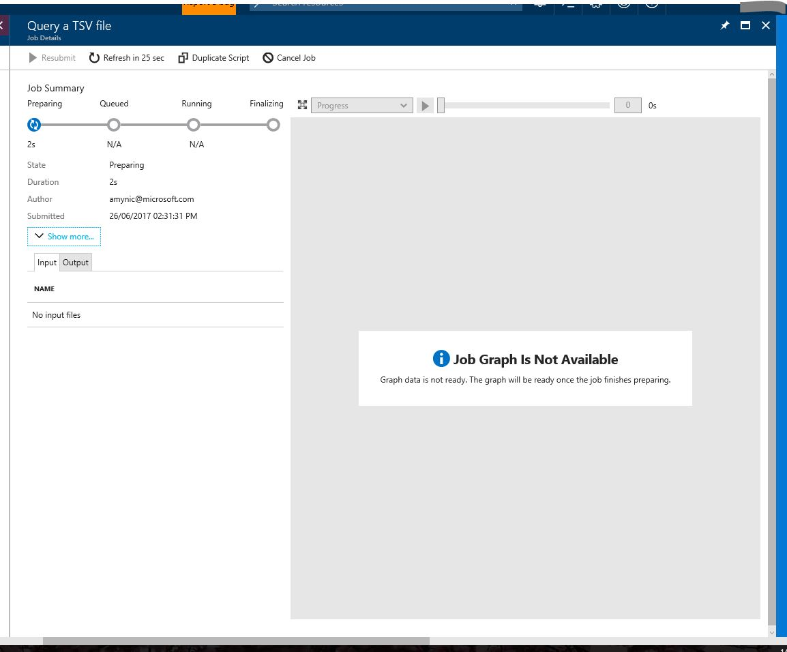

Once the job is running the blade will also produce a job graph - showing the breakdown of the query (input files, output files, extract and aggregate processes)

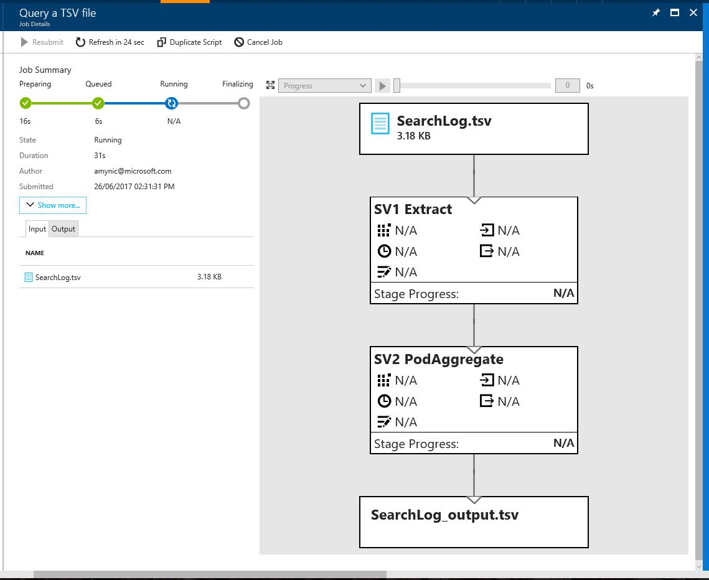

Once the job summary shows the process as complete, the job graph is green and explains how much data (in rows) was written to the output file. Now click the tab 'Output' and select the SearchLog_output.tsv file to review the output data

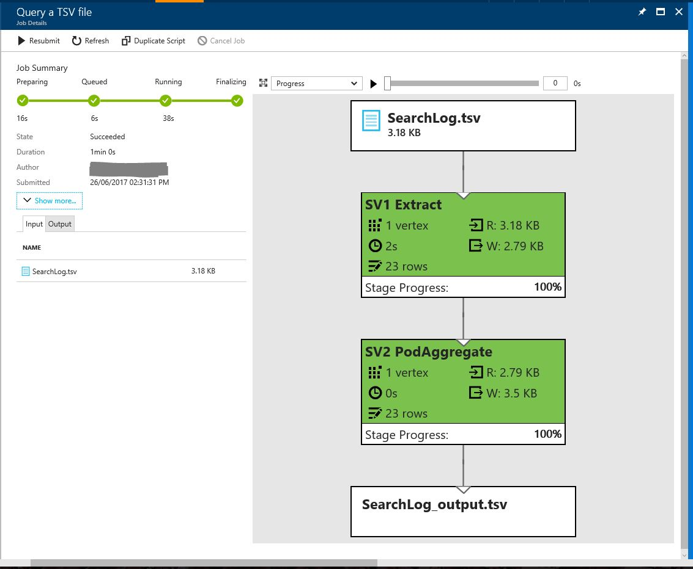
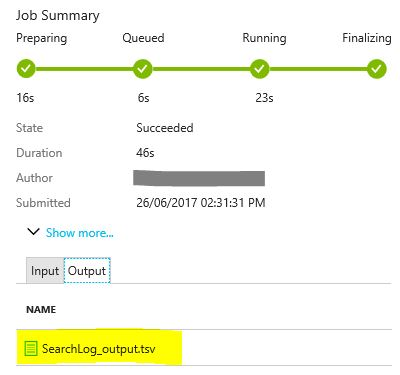

in this file you will see the whole contents of the input file was written to the output file. This query shows the input and output syntax of a simple U-SQL query. 

Now close all blades and go back to the sample scripts blade

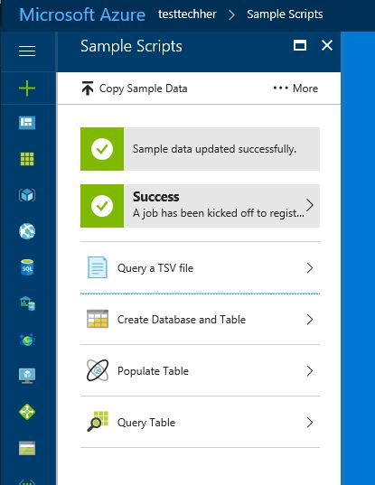

There are 3 more queries to explore:
1. Create Database and Table
2. Populate Table
3. Query Table

Go ahead and run/explore the queries that show you how to create database tables in u-sql in your data lake store, populate the .TSV file data into the database table and query that table to show data in there.

Feel free to [tweak queries and explore the U-SQL language further](https://docs.microsoft.com/azure/data-lake-analytics/data-lake-analytics-u-sql-get-started?WT.mc_id=aiml-0000-amynic).


### Exercise 2: Simpsons Data

**Dataset used: datasets/simpsons_text_analysis.csv**

For the next exercise we are going to use an open data set available here:
to work with data relating to the Simpsons Script Lines - data is available in this github repo [datasets/simpsons_script_lines.csv](datasets/simpsons_script_lines.csv)

download this github repo by choosing **'Clone or download' -> 'Download ZIP'**. This should not take long to download.

 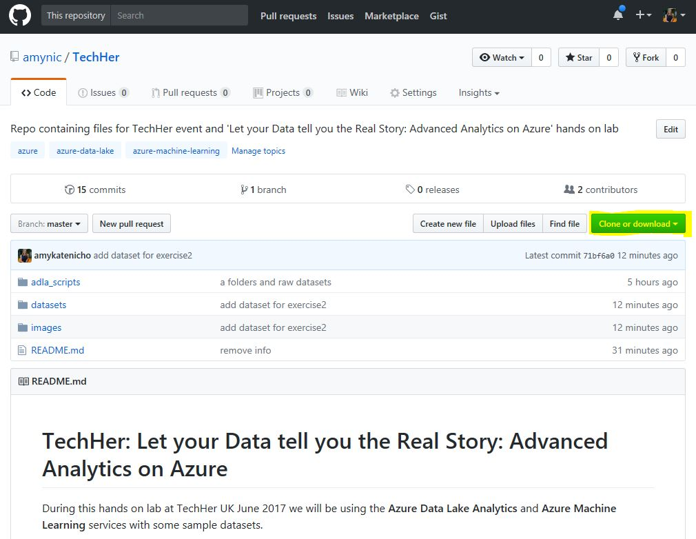

 Once downloaded, save in an accessible place on your device and then extract the files from the .zip folder. In the datasets folder you should see the file *simpsons_script_lines.csv*

 Now go to the azure portal main page (click the top left corner 'Microsoft Azure' image). Type into the search bar next to the notifications symbol the name of your data lake store account

 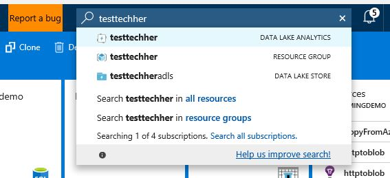

 Once your Data Lake Store is open, explore the data contained using the **'Data Explorer'**

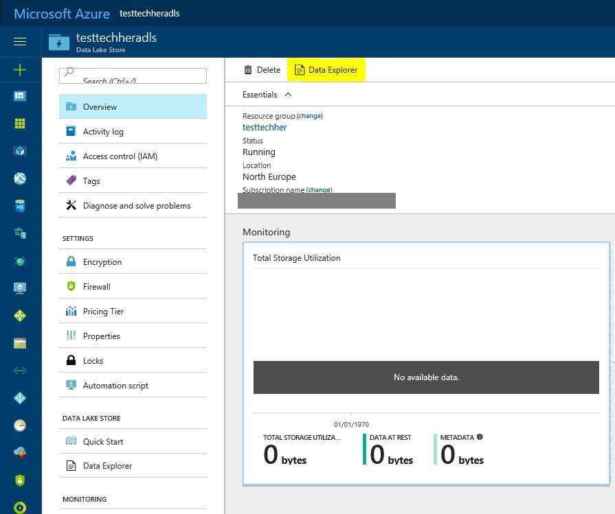

Create a new folder in your store called **'SimpsonsData'**

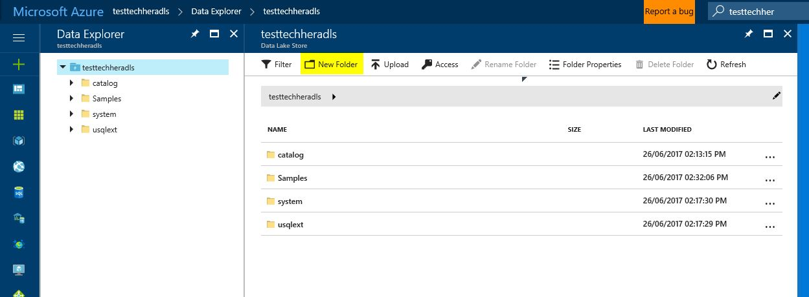

Open the SimpsonsData folder and upload the local *simpsons_script_lines.csv* file

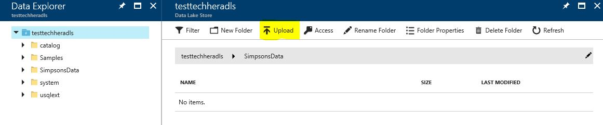
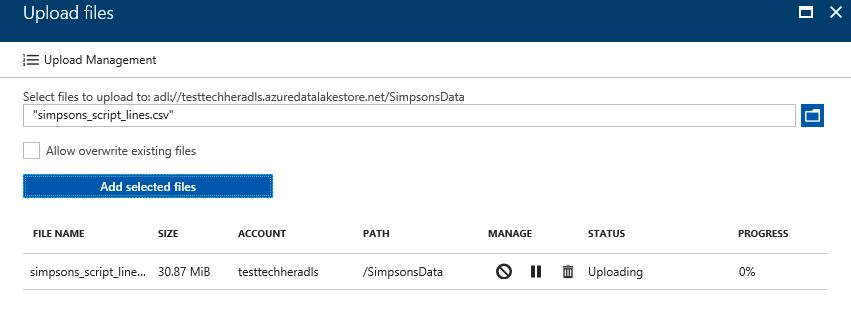

Once the upload is complete (this will take a couple of minutes) click on the file and view the contents of the dataset.

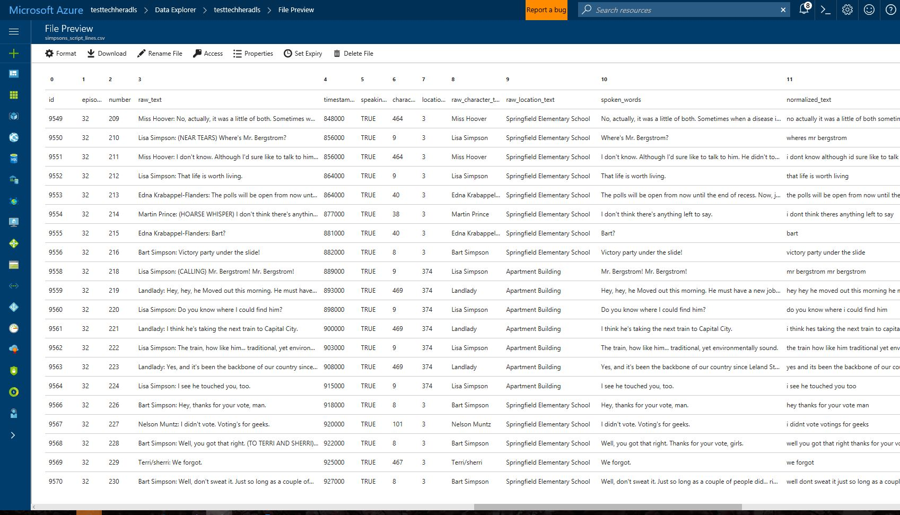

Now go back to the main page of the portal (select Microsoft Azure logo in top left corner of the screen) and find and open your Azure Data Lake Analytics instance

Once open, select **'New Job'**

Edit the Job Name to **'Simpsons 1'**

and copy the code below *(or get code from the adla_scripts folder: simpsons_query_10000_speaking_lines.txt)*

```
//Declare input/output destinations as variables
DECLARE @in  string = "/SimpsonsData/simpsons_script_lines.csv";
DECLARE @out string = "/SimpsonsData/top_speakers_10000.csv";
 
//Extract data to query from CSV file
@result =
    EXTRACT id  int,
            episode_id  int,
            number      int,
            raw_text    string,
            timestamp_in_ms string,
            speaking_line   string,
            character_id    int,
            location_id     int,
            raw_character_text  string,
            raw_location_text   string,
            spoken_words    string,
            normalized_text string,
            word_count  int
    FROM @in
    USING Extractors.Csv(skipFirstNRows:1);

// Take extracted data and count the character spoken lines in the dataset
@calculation =
    SELECT
        raw_character_text,
        COUNT(DISTINCT(id)) AS count
    FROM @result
    GROUP BY raw_character_text;

//Select the characters to return if they have more than 10,000 lines
@toprank =
    SELECT raw_character_text,
           count
    FROM @calculation
    WHERE count >= 10000;
    

// Output the aggregated data to a results file
OUTPUT @toprank
    TO @out
    USING Outputters.Csv();
```
and select **'Submit Job'**

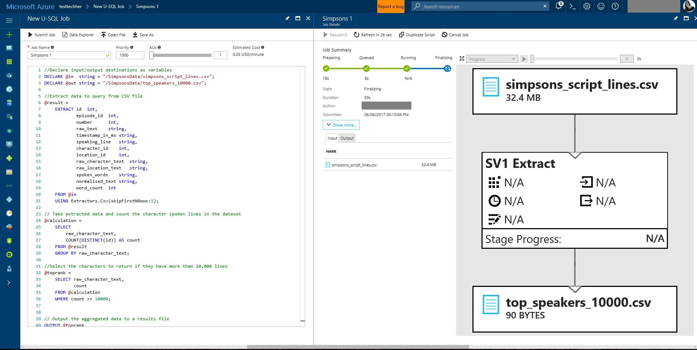

Once the job is completed review the U-SQL query code and then explore the output file. You should see the characters in the Simpsons who have spoken more than 10,000 lines - **are they who you expect?**

Lets tweak this query slightly. On the job details blade choose **'Duplicate Script'**

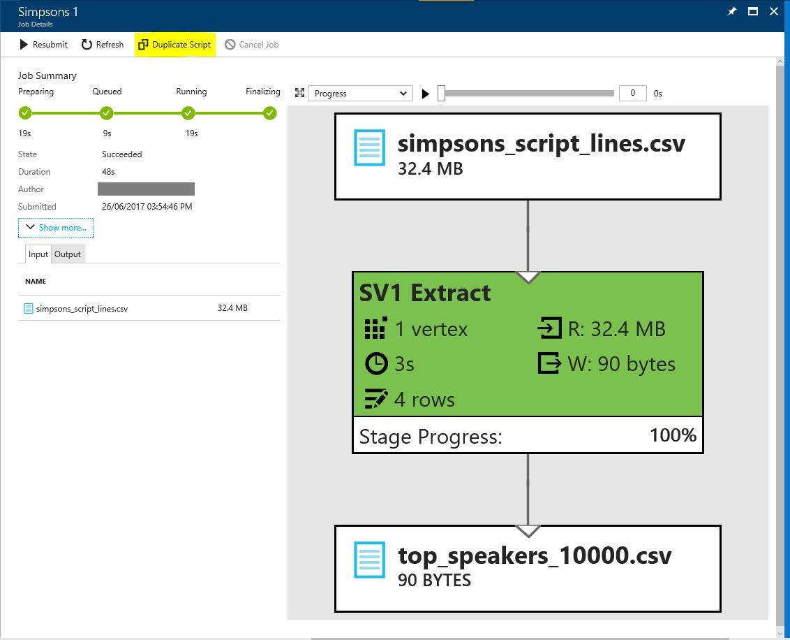

Make edits to the new query so that:
* The job name is 'Simpsons 2'
* The output file is 'top_speakers_2000.csv'
* The WHERE count calculation is >= 2000

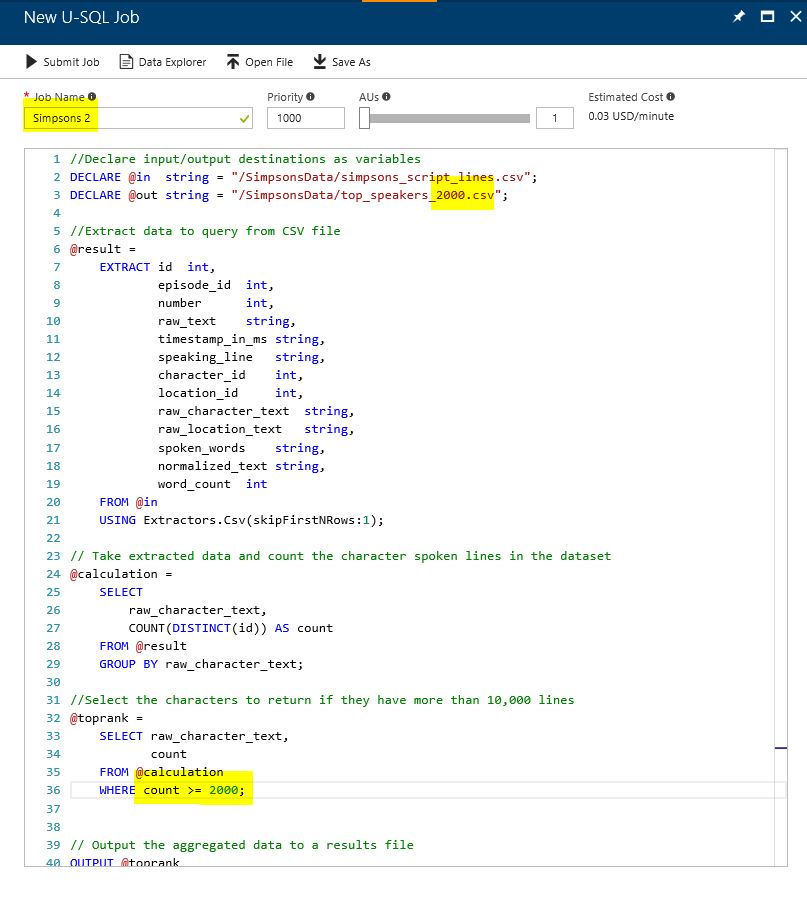

and submit the job. Once complete explore the output results file to see which characters speak more than 2000 lines in the dataset - **are they who you expect?**

### Exercise 3: Cognitive Extensions

Now we will look at creating a query which uses the Text Analytics Cognitive Extension available in Azure Data Lake Analytics. For more information on [Cognitive Extensions see the documentation](https://docs.microsoft.com/azure/data-lake-analytics/data-lake-analytics-u-sql-cognitive?WT.mc_id=aiml-0000-amynic)

First close all the blades you have open until you are at the Azure Data Lake Analytics service main page.

Select **'New Job'**

Rename the job **'Text Analytics'**

and add/review the code below:

```
REFERENCE ASSEMBLY [TextCommon];
REFERENCE ASSEMBLY [TextSentiment];
REFERENCE ASSEMBLY [TextKeyPhrase];

//Declare input/output destinations as variables
DECLARE @in  string = "/SimpsonsData/simpsons_script_lines.csv";
DECLARE @out string = "/SimpsonsData/simpsons_text_analysis.csv";

//Extract data to query from CSV file
@result =
    EXTRACT id  int,
            episode_id  int,
            number      int,
            raw_text    string,
            timestamp_in_ms string,
            speaking_line   string,
            character_id    int,
            location_id     int,
            raw_character_text  string,
            raw_location_text   string,
            spoken_words    string,
            Text string,
            word_count  int
    FROM @in
    USING Extractors.Csv(skipFirstNRows:1);

// Apply the Cognition.Text.SentimentAnalyzer function to the Text Column in the dataset
@sentiment =
    PROCESS @result

    PRODUCE id,
            episode_id,
            raw_character_text,
            raw_location_text,
            spoken_words,
            Text,
            Sentiment string,
            Conf double
    READONLY id,
            episode_id,
            raw_character_text,
            raw_location_text,
            spoken_words,
            Text
    USING new Cognition.Text.SentimentAnalyzer(true);

// Output the results to a csv file
OUTPUT @sentiment
    TO @out
    USING Outputters.Csv();
```
and select **'Submit Job'**

This query will take slightly longer to run than the previous queries
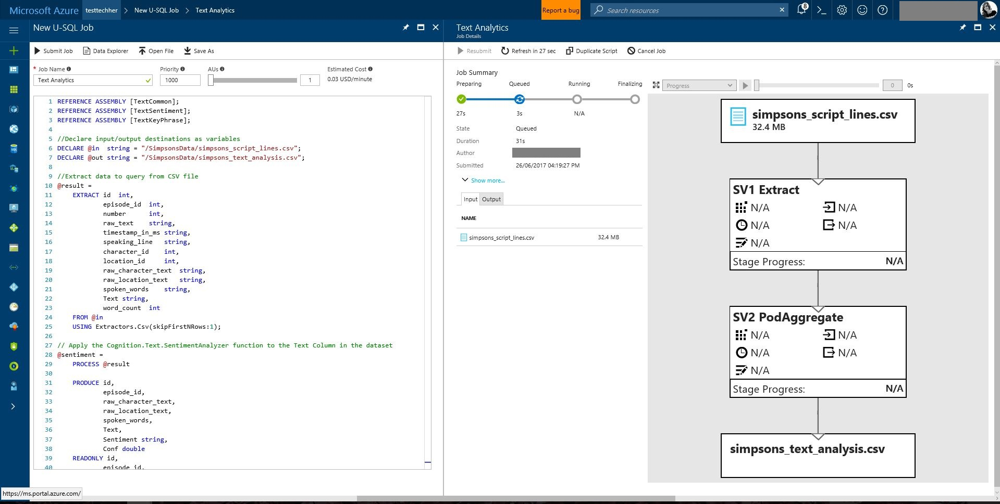

Once completed view the output file to see that each row in the data now has a sentiment tag (positive/negative/neutral) and a confidence value associated to the assignment

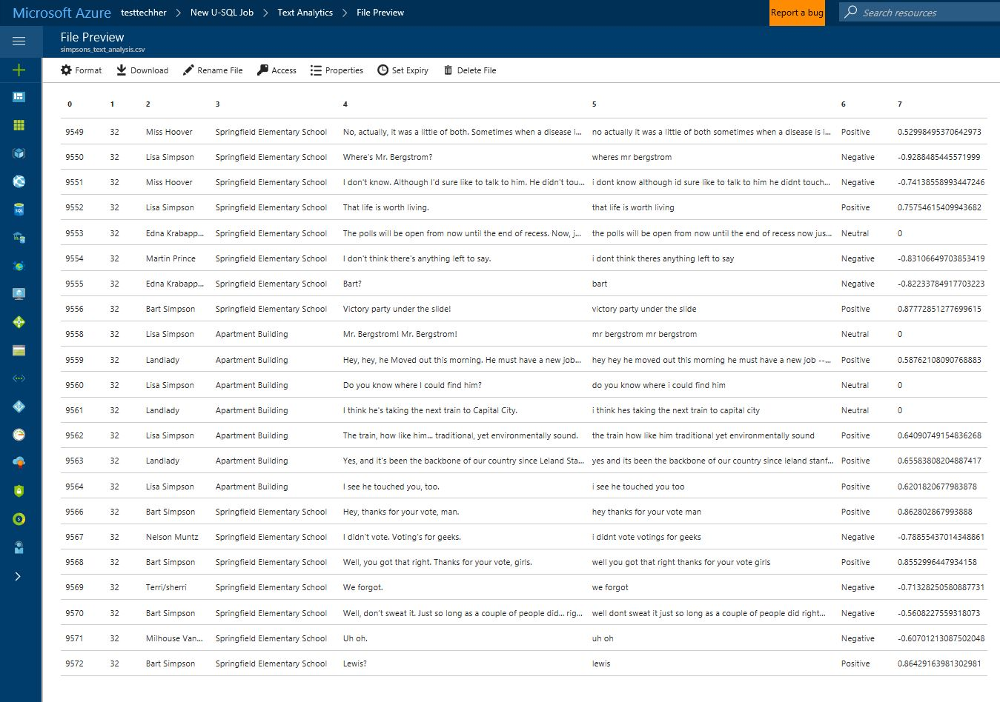

In this output view, its quite hard to summarise the dataset - so lets do that ...

Close all the blades and **create a new job**

Call is **'Text Analytics Summary'**

and add/review the code below:

```
//Declare input/output destinations as variables - NOTE the change of input file
DECLARE @in  string = "/SimpsonsData/simpsons_text_analysis.csv";
DECLARE @out string = "/SimpsonsData/simpsons_text_analysis_summary.csv";

//Extract data to query from CSV file
@result =
    EXTRACT id  int,
            episode_id  int,
            raw_character_text  string,
            raw_location_text   string,
            spoken_words    string,
            Text    string,
            Sentiment string,
            Conf double
    FROM @in
    USING Extractors.Csv();

// Count the occurence of each sentiment throughout the dataset
@summary = 
    SELECT
        Sentiment,
        COUNT(DISTINCT(id)) AS count
    FROM @result
    GROUP BY Sentiment;

// Output the aggregated data to a results file
OUTPUT @summary
    TO @out
    USING Outputters.Csv();

```
and select **'Submit Job'**


Review the output of the query:

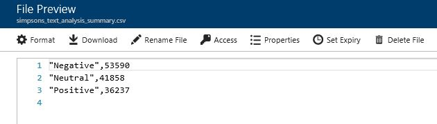

## Review

In this part of the lab you have walked through sample scripts and learnt about the Azure Portal for submitting and reviewing scripts, used our own data to query and added cognitive capabilities.

For further information on Azure Data Lake Analytics see [the documentation](https://docs.microsoft.com/azure/data-lake-analytics/data-lake-analytics-overview?WT.mc_id=aiml-0000-amynic)

For further code samples see the [Azure/usql github repo](https://github.com/Azure/usql)

# Azure Machine Learning

**Dataset used: datasets/carPriceData.csv**

For this sample, open the **azureml_lab/AzureMachineLearningLab.docx** to view full material

### The Problem Domain

During this lab, we will create and evaluate two models, that given past data collected about cars and their values, will try to predict the price/value of a car given other attributes associated with the car:

* The attribute columns in the dataset include values such as the model/make, fuel type and body style as well as performance values such as MPG, horsepower and engine type
* The value we are trying to predict is the price of the car. In this dataset, the values range from £5,000 to £45,000.

We will retrieve data from an Azure Blob Storage account and start to pre-process the dataset ready to train a machine learning model. The model we’ll create is a form of supervised learning so we will use historical car attributes and values to predict the price of future cars we might receive. This model will perform a regression algorithm to try and predict the actual price of the car with the lowest amount of error, for example £16,595. This information is in the sample data in the ‘price’ column.


### Setup an Azure ML Account

In the previous lab, you should have setup your Azure Subscription. Now visit the link: [http://studio.azureml.net/](http://studio.azureml.net/) and choose **‘Sign Up’**
Select the **Free Workspace Option** (green tab) and sign in using your Microsoft Azure credentials

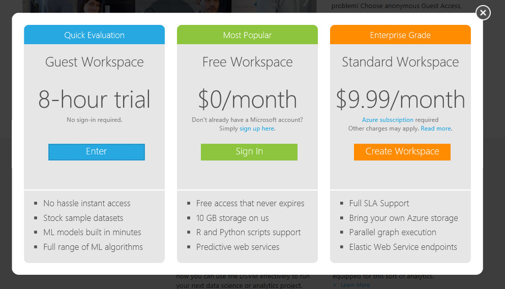

This will take you to the Azure Machine Learning Studio, by default you will end in the Experiments tab on the left but there are other tabs available and described below:

* **Projects:** Like a file-explorer, a place to keep all associated resources together for a similar project. You may look at creating a project called ‘AzureMLStudioLab’ to keep all the experiments, notebooks and datasets you create today in one place that’s well organised.
* **Experiments:** As you start creating machine learning experiments/models you will build up a list of different experiments that can be add, edited and deleted by an owner of the workspace
* **Web Services:** Once you have created a model and are ready to make it a production-ready API, this is the section you will find all your web services listed under
* **Notebooks:** You may have already explored notebooks. Although the Studio provides an easy to use, yet powerful, drag-drop style of creating experiments, you sometimes need a good old “REPL” to have a tight loop where you enter some script code and get a response. This functionality is integrated into ML Studio through Jupyter Notebooks
* **Datasets:** A place to store datasets/folders of scripts or functions (CSV, TSV,.zip) that you upload from your local machine
* **Trained Models:** Each time you create a model and start scoring against it to create a web service, this will create a ‘Trained Model’ module that will be reusable. This will be your chosen algorithm, trained on your chosen data in order to answer a machine learning question. 
* **Settings:** The settings tab allows you to add descriptions to your workspace as well as add new users so you can work in a more collaborative environment when designing your machine learning algorithms


### Start with a sample

For a shorter sample of using Azure Machine Learning, please find an experiment already pre-processed in the [Cortana Intelligence Gallery](https://gallery.cortanaintelligence.com/) here: 
* [https://gallery.cortanaintelligence.com/Experiment/TechHer-Sample-Experiment](https://gallery.cortanaintelligence.com/Experiment/TechHer-Sample-Experiment)

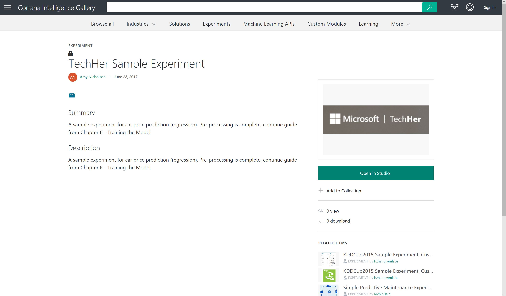

Now choose the button **Open in Studio**

An check the experiment will be placed in your free workspace

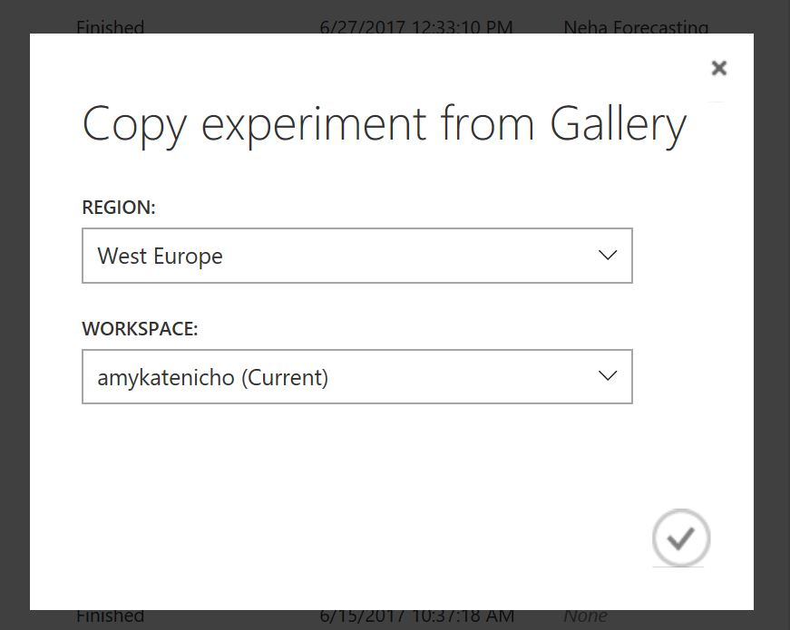

Choose the tick if correct and the experiment will open in Azure Machine Learning

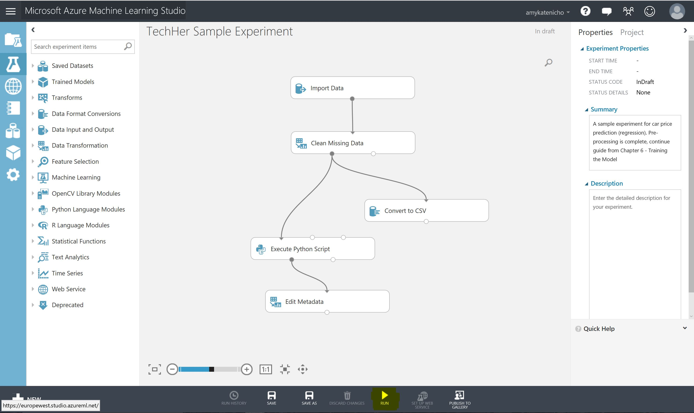

Once open select the **Run** button in the bottom toolbar and wait until the experiment modules have green ticks by them

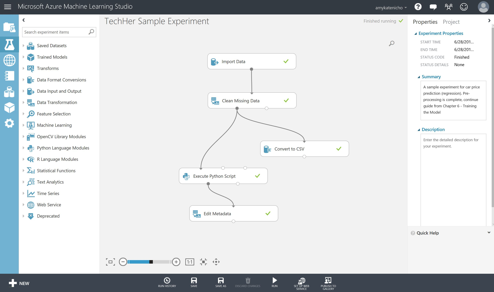

Take a look at the sample data by selecting the output port of the final model 'edit metadata' 

* Right Click output port of Edit Metadata Module
* Select Vizualise

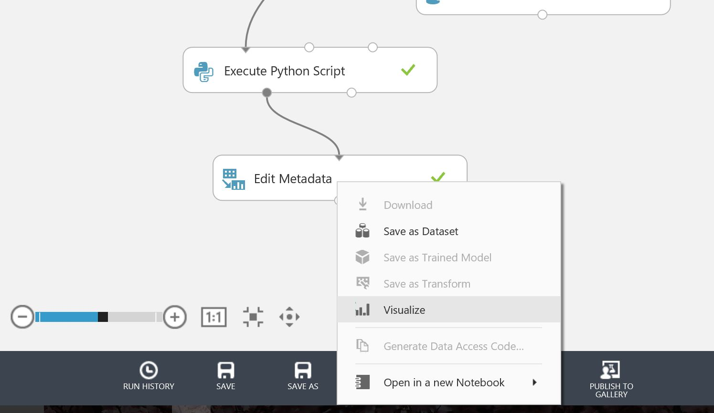

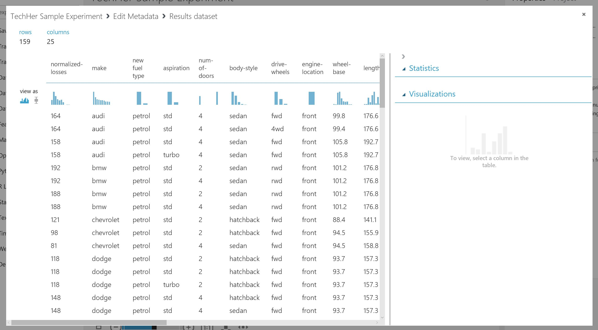

### Back to the Document

Now you are ready to build the Supervised Machine Learning Regression model to predict the price of a car.

Open the **azureml_lab/AzureMachineLearningLab.docx** 
or **azureml_lab/AzureMachineLearningLab.pdf**
 documents and find the Chapter entitles **Training the Model** and work through the content from there.

 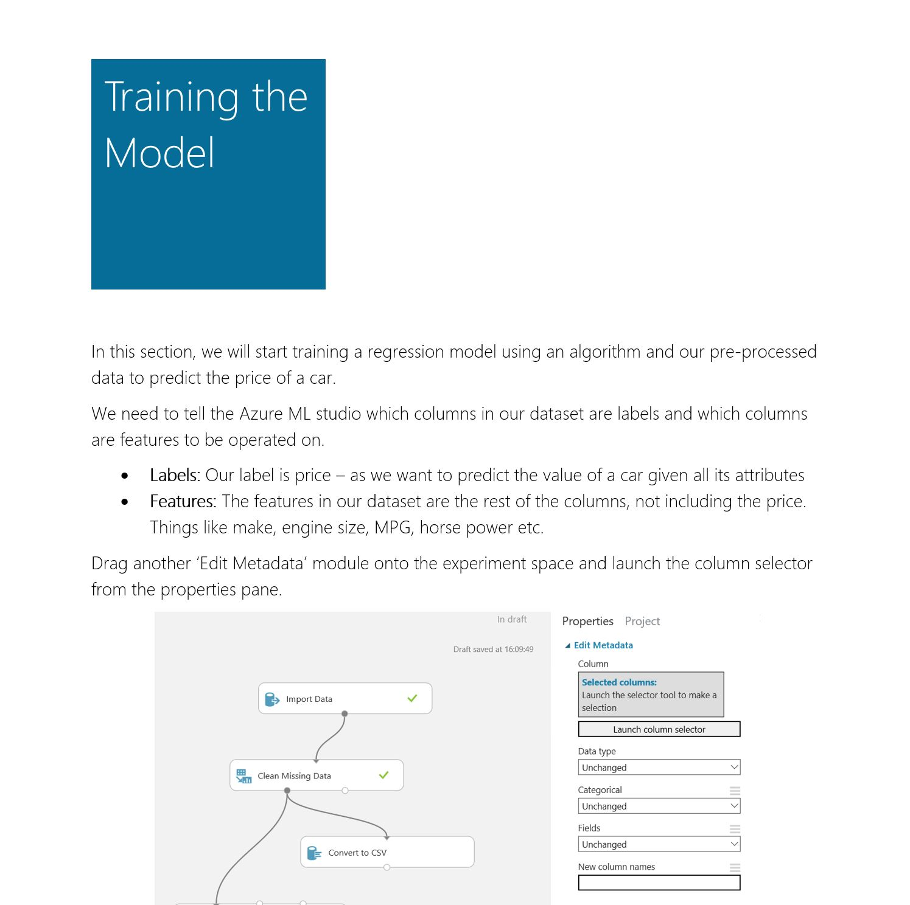

 ### Publishing your Model

 Next step can be to publish your experiment as a predictive model that can be called via a REST API

 Follow the document **azureml_lab/AzureMachineLearningLab_Publishing.docx**
 or **azureml_lab/AzureMachineLearningLab_Publishing.pdf** 

 If you don't have a completed experiment at this point you can find one here:
 *  [https://gallery.cortanaintelligence.com/Experiment/TechHer-Full-Experiment](https://gallery.cortanaintelligence.com/Experiment/TechHer-Full-Experiment)

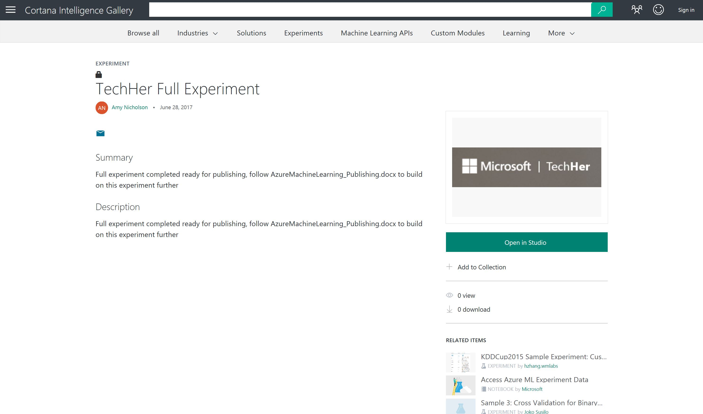


# Microsoft Cognitive Services

For more information on these services: [https://azure.microsoft.com/services/cognitive-services/?WT.mc_id=aiml-0000-amynic](https://azure.microsoft.com/services/cognitive-services/?WT.mc_id=aiml-0000-amynic)

## Text Analytics Sample

Go to [https://azure.microsoft.com/try/cognitive-services/?WT.mc_id=aiml-0000-amynic](https://azure.microsoft.com/try/cognitive-services/?WT.mc_id=aiml-0000-amynic) to obtain a free API key. Choose the **'Language'** tab and then **'Text Analytics API'** and create

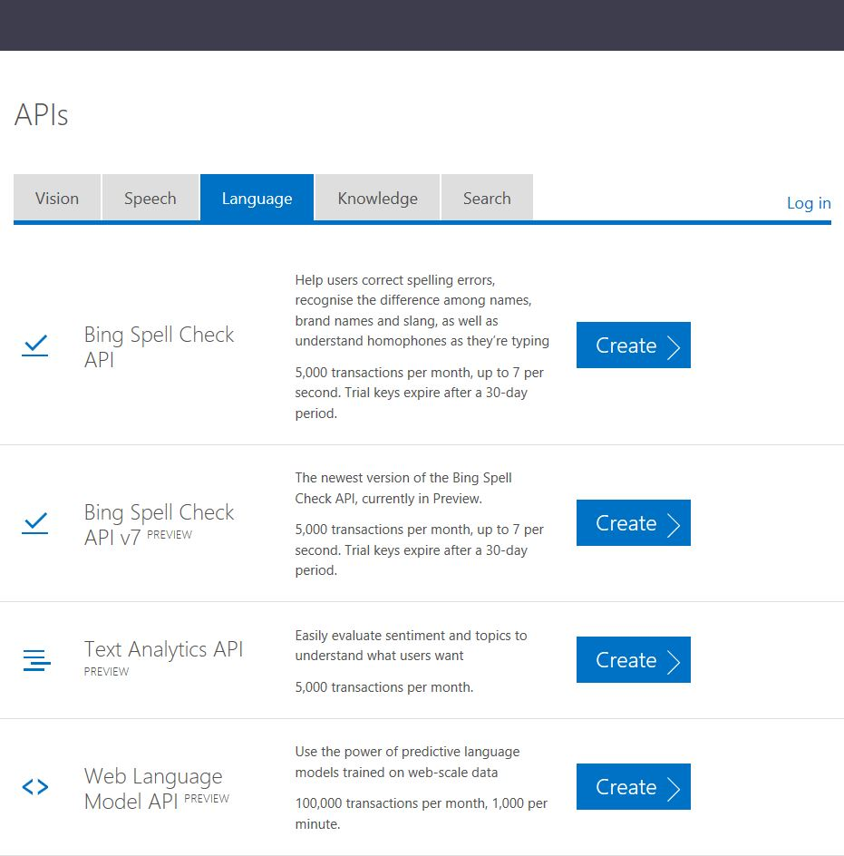

Agree to the terms and conditions and then sign in using a preferred account

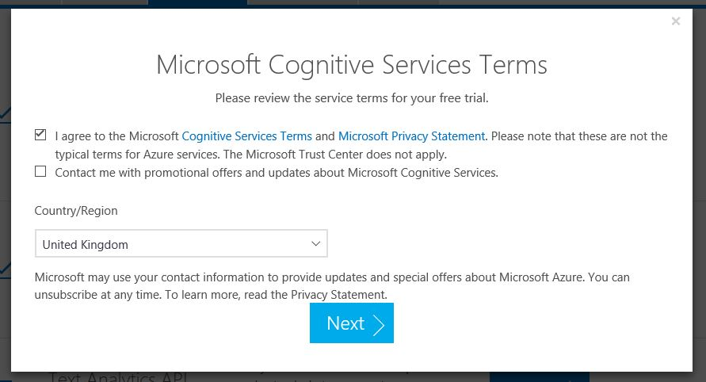
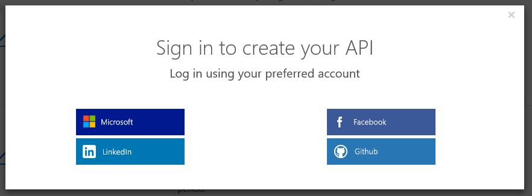

Then you should be assigned an API key for Text Analytics free for 30 days. Take note of the **Endpoint and Key 1, Key 2** values, you will need them shortly.

Next you can either use the in-browser testing API console here: [https://westus.dev.cognitive.microsoft.com/docs/services/TextAnalytics.V2.0/operations/56f30ceeeda5650db055a3c7/console?WT.mc_id=aiml-0000-amynic](https://westus.dev.cognitive.microsoft.com/docs/services/TextAnalytics.V2.0/operations/56f30ceeeda5650db055a3c7/console?WT.mc_id=aiml-0000-amynic)

Or use an app such as [Postman](https://www.getpostman.com/) or [Fiddler](http://www.telerik.com/fiddler/fiddlercore).

Now follow **'Task 2'** in the documentation getting started guide to detect sentiment, key phrases and language in a piece of text.

[Task 2 Instructions here](https://docs.microsoft.com/azure/cognitive-services/text-analytics/quick-start?WT.mc_id=aiml-0000-amynic#task-2---detect-sentiment-key-phrases-and-languages)

For example using Postman, the requests look like below:

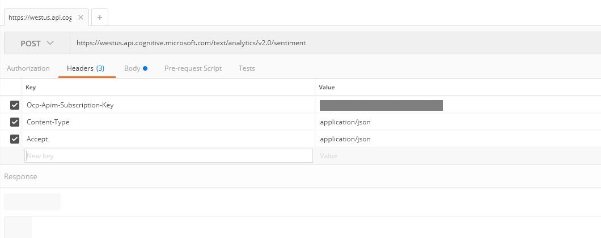
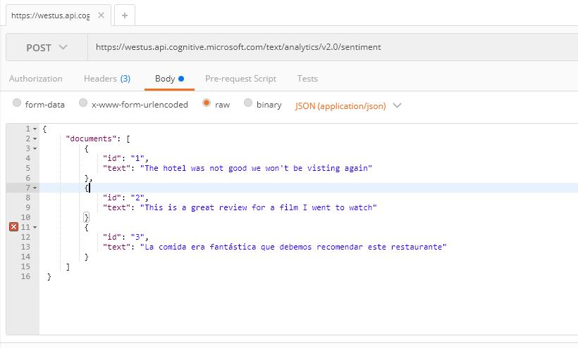

Responses returned for each of the API calls:

**POST https://westus.api.cognitive.microsoft.com/text/analytics/v2.0/sentiment?WT.mc_id=aiml-0000-amynic**

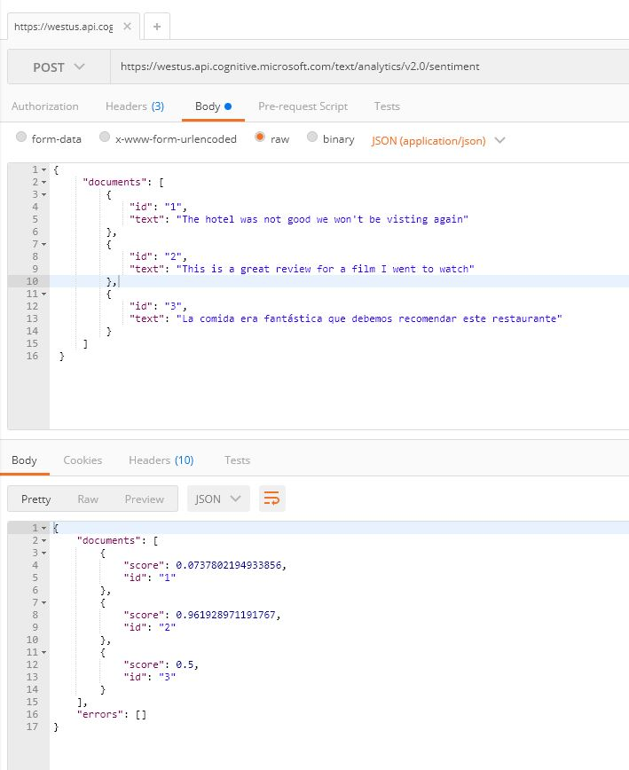

**POST https://westus.api.cognitive.microsoft.com/text/analytics/v2.0/keyphrases?WT.mc_id=aiml-0000-amynic**

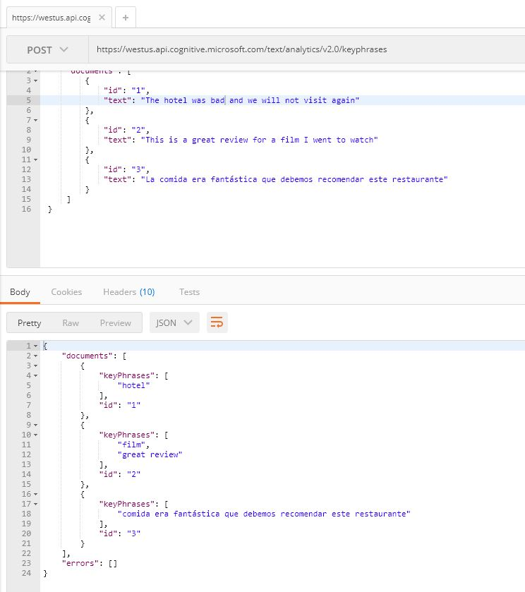

**POST https://westus.api.cognitive.microsoft.com/text/analytics/v2.0/languages?WT.mc_id=aiml-0000-amynic**

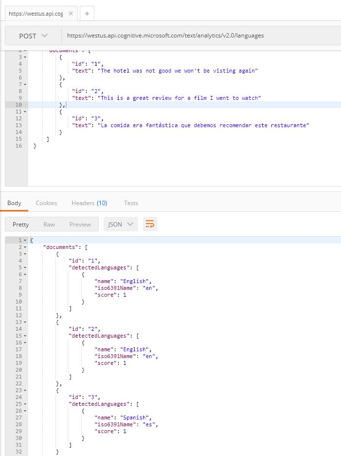

## Computer Vision Sample

If you want to try out the Computer Vision sample - try out the Analysing Image capability with a C# sample application in your DSVM

[https://docs.microsoft.com/azure/cognitive-services/computer-vision/quickstarts/csharp?WT.mc_id=aiml-0000-amynic#AnalyzeImage](https://docs.microsoft.com/azure/cognitive-services/computer-vision/quickstarts/csharp?WT.mc_id=aiml-0000-amynic#AnalyzeImage)

In the same place you got your Text Analytics API key you can scroll to the bottom and **'Add'** the Computer Vision API key as well

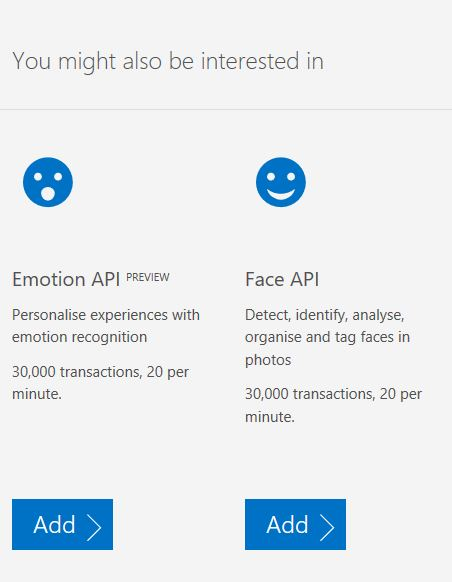


# Microsoft R Server and R in SQL Server

A great place to get started with our offerings in this space is via the solution templates in the Cortana Intelligence Gallery: [https://gallery.cortanaintelligence.com/](https://gallery.cortanaintelligence.com/)

In this lab we will look at the **Loan Credit Risk with SQL Server and R**: [https://gallery.cortanaintelligence.com/Solution/Loan-Credit-Risk-with-SQL-Server-2](https://gallery.cortanaintelligence.com/Solution/Loan-Credit-Risk-with-SQL-Server-2)

1. First browse to the [Cortana Intelligence Gallery](https://gallery.cortanaintelligence.com/)
2. Search for **'r server'** in the top search box
3. Once results have loaded, select **'Solution'** in the **refine by categories** section on the left
4. Select **'Loan Credit Risk with SQL Server'**

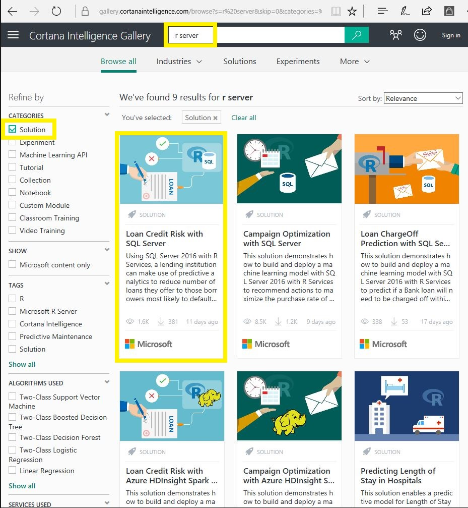

5. Read through the descripton of the solution we will deploy
6. Now click **'Deploy'**

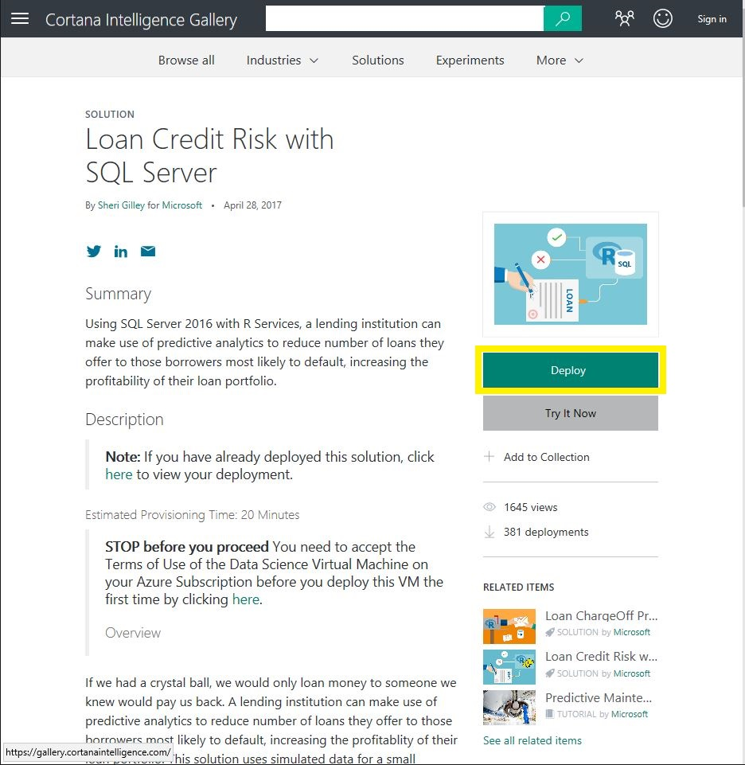

7. Now to setup some details for the deployment within the [Data Science Virtual Machine (DSVM)](https://docs.microsoft.com/azure/machine-learning/machine-learning-data-science-virtual-machine-overview?WT.mc_id=aiml-0000-amynic)
8. Enter a deployment name, for example **'rsample'**, choose a subscription, a location for the deployment of resources for example **'East US'** and provide a short description 

*Note: you may need to accept some license agreements for the solution to deploy in your subscription, enable for the subscription and then continue*

9. Click **Create**

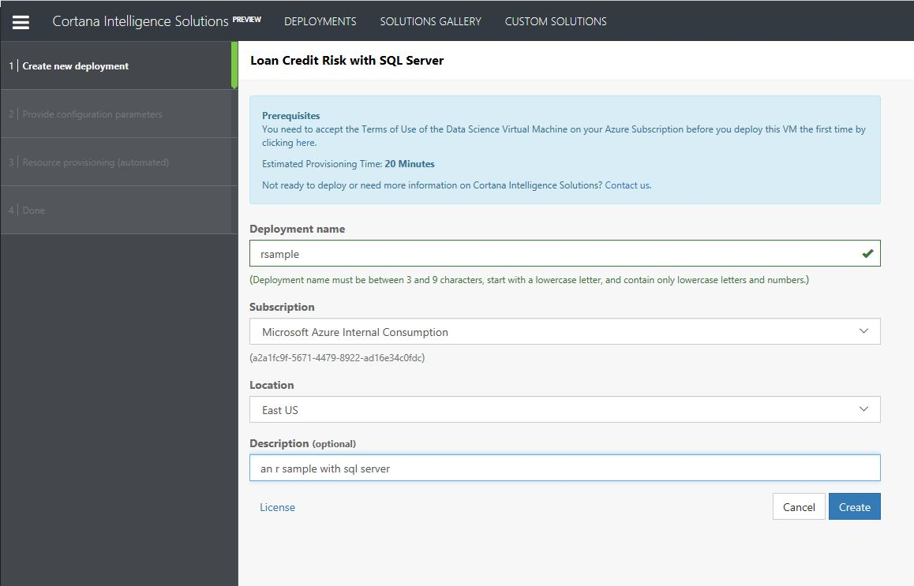

10. Now provide details for the DSVM such as username, password and name
11. Choose **Next**

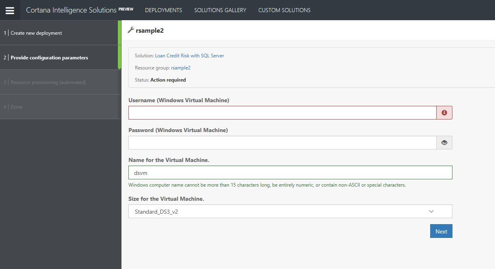

12. The deployment could take up to 20 mins but progress will be shown in the screen below.

*NOTE: if there are any issues with deployment and it fails, please select retry*

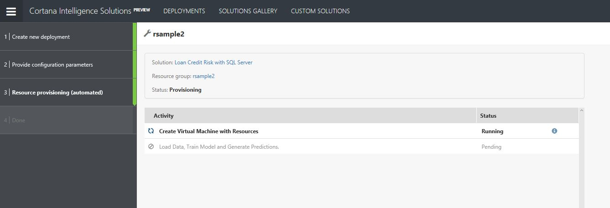

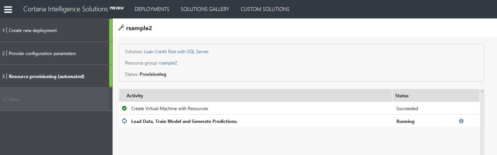

13. Once complete you can connect to the DSVM via the link highlighted below. This will take you to the Azure Portal

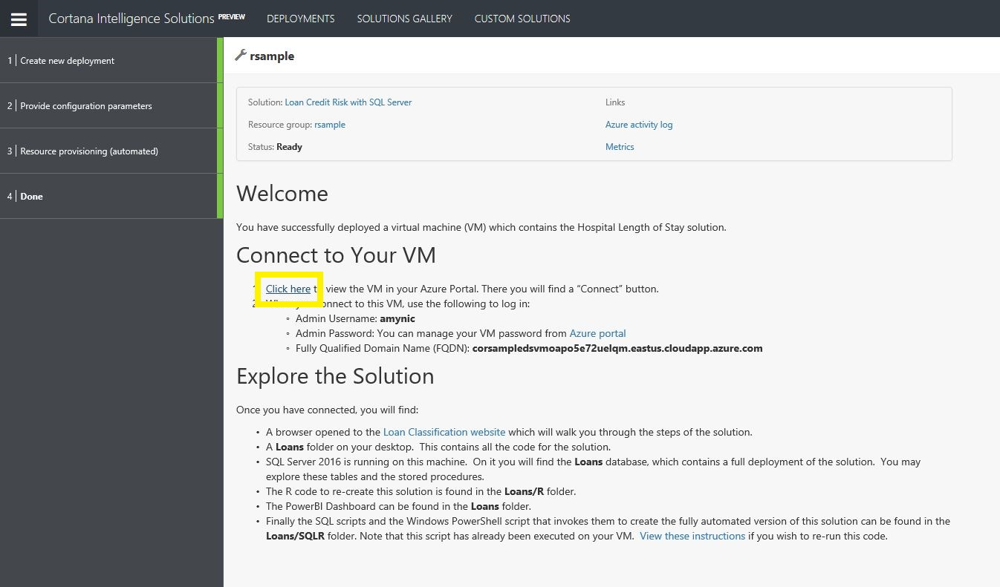

14. In the Azure portal, click Connect and sign into the VM with the details you provided on setup

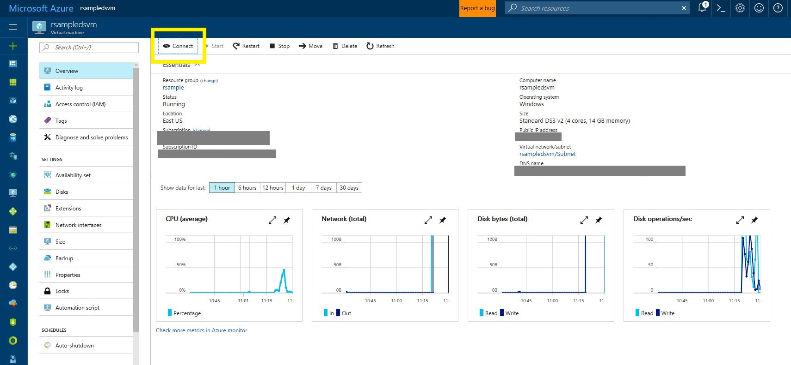

15. Once signed in and the VM had loaded, by default a browser windows should open with details of the solution setup. 
16. Read through these details and start exploring R in SQL Server

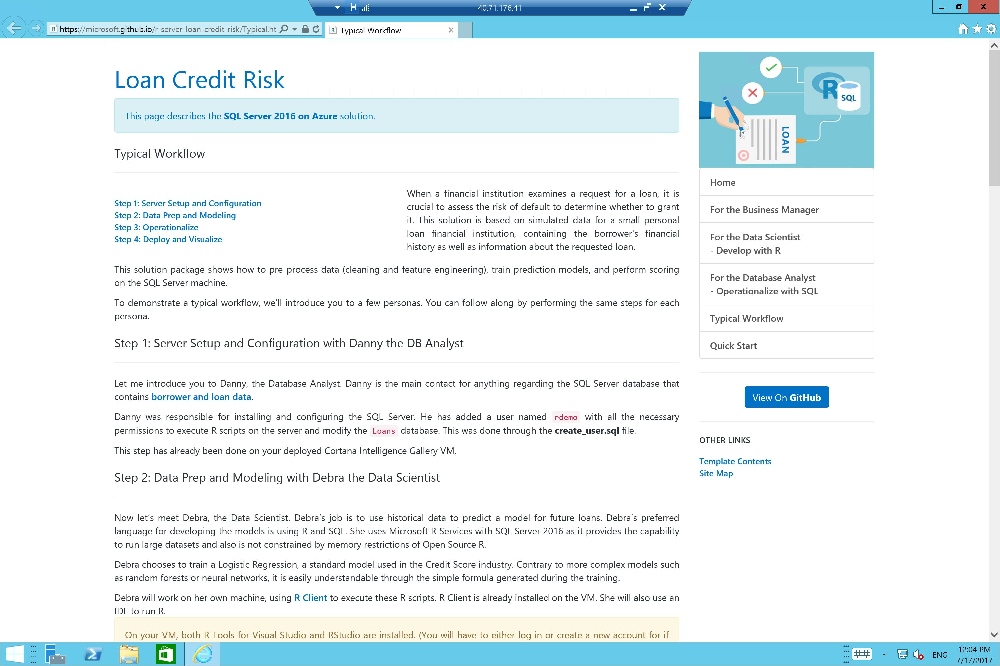

# Tidy Up Resources

We setup some solution resources during this lab, in order to stop them occuring charges please remove any resources setup.

## Remove Solution Template: R Server

There is a quick way to remove all resources from this lab, go to: [https://start.cortanaintelligence.com/Deployments](https://start.cortanaintelligence.com/Deployments)

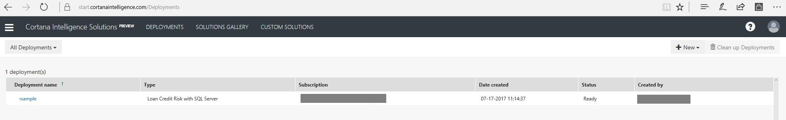

Select your sample deployment and click the 'bin' icon to remove all resources.

## Remove Cognitive Service resources

Nothing we used in this section will incur any costs, free trial API

## Remove Azure Machine Learning Resources
Nothing we used in this section will incur any costs (free workspace)
However in the azure portal you can remove the Machine Learning Workspace


# EXTRA: Azure Machine Learning Workbench Documentation Tutorial

The Azure machine learning workbench team have put together a great step by step tutorial for you to explore the new workbench tool and see how this could support your machine learning projects in production

Follow the step-step below from installation to deployment. Also keep exploring the documentation for more features and examples [here](https://docs.microsoft.com/azure/machine-learning/preview/?WT.mc_id=aiml-0000-amynic)

1)	Install and Create workspaces: [https://docs.microsoft.com/azure/machine-learning/preview/quickstart-installation?WT.mc_id=aiml-0000-amynic](https://docs.microsoft.com/azure/machine-learning/preview/quickstart-installation?WT.mc_id=aiml-0000-amynic)
2)	TUTORIAL: Prepare data: [https://docs.microsoft.com/azure/machine-learning/preview/tutorial-classifying-iris-part-1?WT.mc_id=aiml-0000-amynic ](https://docs.microsoft.com/azure/machine-learning/preview/tutorial-classifying-iris-part-1?WT.mc_id=aiml-0000-amynic)
3)	TUTORIAL: Build a model: [https://docs.microsoft.com/azure/machine-learning/preview/tutorial-classifying-iris-part-2?WT.mc_id=aiml-0000-amynic](https://docs.microsoft.com/azure/machine-learning/preview/tutorial-classifying-iris-part-2?WT.mc_id=aiml-0000-amynic )
4)	TUTORIAL: Deploy a model: [https://docs.microsoft.com/azure/machine-learning/preview/tutorial-classifying-iris-part-3?WT.mc_id=aiml-0000-amynic](https://docs.microsoft.com/azure/machine-learning/preview/tutorial-classifying-iris-part-3?WT.mc_id=aiml-0000-amynic )

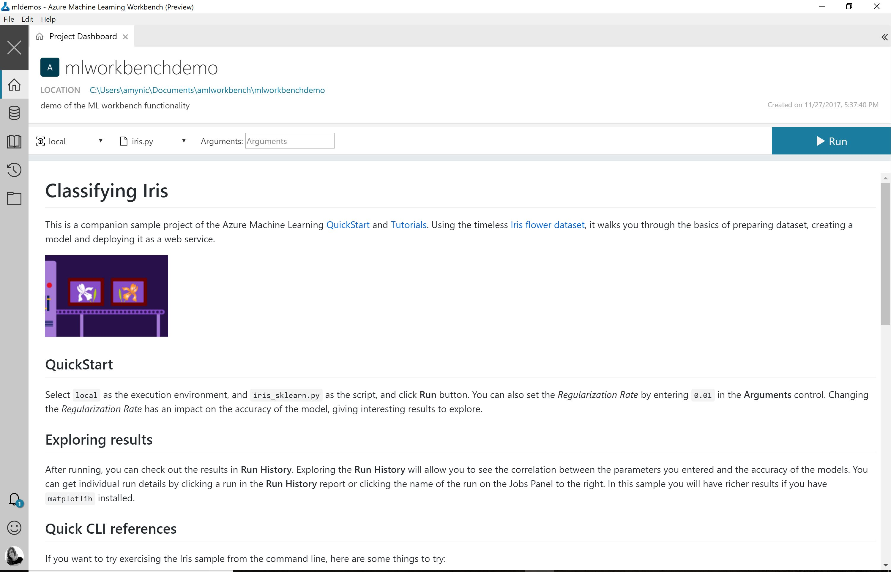